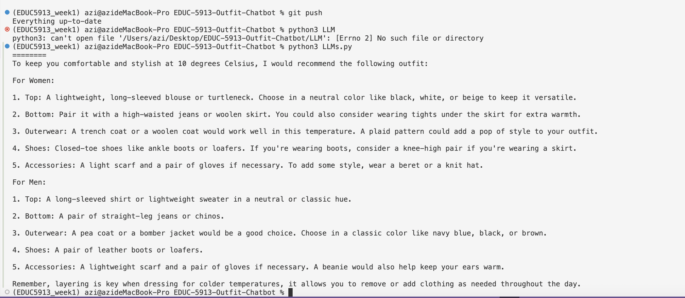

# EDUC-5913-Outfit-Chatbot
:)

## Introduction

💖Hello everyone. The project of Haipei and I wants to establish a vertical chatbot system integrating multiple models for daily clothing matching. We combine text language models and image recognition capabilities to provide real-time feedback based on user-input images, temperatures within a limited time range, and dressing scenarios.

💖大家好，我和海培的项目想要建立一个集成多种模型的垂直领域聊天机器人系统，用于日常服装搭配。我们结合了文本语言模型以及图片识别能力，依据用户输入的图片、限定时间范围内的气温、穿搭所需场景来进行实时反馈。 

😇Since there are two of us writing code simultaneously, maintenance and collaborative construction are of great significance in code editing. For example, every time we add a new model type, we need to make manual modifications in multiple parts of the code, which makes it easy to miss something or introduce errors. 

😇因为我们是两个人同时写作，所以维护和共建在代码编辑中显得十分重要。譬如说， 当我们每次新增一个模型类型，都需要在代码的多处手动修改，容易遗漏或引入错误。

## Potential issues
### 🤯Potential Scenario 1 潜在场景1 
```python
# new additional model "gpt5"
if model_type == "gpt5":
print("Running GPT-5")
```
Issues 问题所在:

• If these strings are used in dozens of places, we need to check one by one to see if they have all been updated.

• Without centralized management, it's very easy to miss something or cause logical conflicts. 

•	如果有几十处地方使用了这些字符串，我们需要逐一检查是否都更新了。

•	没有集中管理时，很容易遗漏或导致逻辑冲突。

### 🤯Potential Scenario 2 潜在场景2

When I want to deploy a local open-source model from Hugging Face by myself, my team doesn't recognize this small self-owned model. Using strings directly can't provide any context information, and at this time, the meaning of the code isn't clear enough. 

当我想要自己部署一个hugging face 上的本地开源模型， 我的team 不认识这个自有小模型， 直接使用字符串无法提供任何上下文信息，此时代码的含义不够清晰。

```python
if model_type == "llama3":
print("Model is LLaMA-3")
```

Issues 问题所在:

•	What is "llama3"? Is it a variable? Or a specific value?

•	"llama3" 是什么？一个变量？还是一个具体的值？

**⚠️Therefore, during the process of writing code, what we consider is not just the construction of the system. How to make our existing system more semantic (clear), safer and easier to maintain is of crucial importance. Hence, in the early stage of building the system, we introduced "Enum". Although the following piece of code is simple, its advantages will become more and more obvious as the program becomes more complex.**

**⚠️因此，在写代码的过程中， 我们考虑的不仅仅是系统的构建， 如何将我们现有系统构建得更语义化（清晰）、更安全、更易维护，至关重要。 所以，在构建系统的前期，我们引入了“Enum”。 
以下段代码虽然简单，但它的好处会在程序变复杂时越来越明显。**


```python
class ModelType(Enum):
    """Supported model types"""
    LLAMA3 = "llama3"
    GPT4 = "gpt4"
    GPT35 = "gpt3.5"
```
## So, What is the Benefit of Using Enum?

🧠Define a set of fixed model types, which represent a set of options that won't change randomly.

🧠定义一组固定的模型类型，这些模型类型代表了一组不会随意变化的选项。

🤙🏻Improve the readability of code

🤙🏻提高代码的可读性

👌🏻Improve code security

👌🏻提高代码安全性

Besides the issue of string spelling, when using enums, IDEs or code checking tools will automatically prompt errors.

除了字符串拼写的问题， 用枚举时，IDE 或代码检查工具会自动提示错误
```python
if model_type == ModelType.GPT5:  # If GPT5 is not defined, an error will be reported here.
print("This is GPT-4")
```

😁More convenient for expansion and maintenance.

😁更方便的扩展和维护

Suppose a new model needs to be added in the future, such as "gpt5". You can directly add a new member to the enumeration class: 

假设以后需要添加一个新的模型，比如 "gpt5"，可以直接在枚举类中新增成员：

```python
class ModelType(Enum):
    LLAMA3 = "llama3"
    GPT4 = "gpt4"
    GPT35 = "gpt3.5"
GPT5 = "gpt5"  # newly added
```

## Scaling 

😆Similarly, the @dataclass we use later is also considered for the same reason: We hope it can simplify class definitions in the code and enhance its maintainability. 

😆同理，我们在之后使用的@dataclass也是拥有同样的考虑： 希望代码简化类定义、增强其可维护性。

For example, without @dataclass, we would need to write these methods manually:
例如，如果没有 @dataclass，我们需要手动编写这些方法：

```python
class ModelConfig:
    def __init__(self, model_type, max_length=4096, temperature=0.7):
        self.model_type = model_type
        self.max_length = max_length
        self.temperature = temperature

    def __repr__(self):
        return f"ModelConfig(model_type={self.model_type}, max_length={self.max_length}, temperature={self.temperature})"

    def __eq__(self, other):
        if not isinstance(other, ModelConfig):
            return False
        return (self.model_type == other.model_type and
                self.max_length == other.max_length and
                self.temperature == other.temperature)
```

**However, after using @dataclass, the effect is exactly the same and the code is quite concise.**

**但有了@dataclass 之后， 效果完全相同，代码相当简洁。**

```python
from dataclasses import dataclass

@dataclass
class ModelConfig:
    model_type: str
    max_length: int = 4096
temperature: float = 0.7
```


```python
from typing import Optional
from enum import Enum
import logging
from transformers import AutoTokenizer, AutoModelForCausalLM
import torch
import openai
from dataclasses import dataclass
```
Define the name in case of miswritting
```python
class ModelType(Enum):
    """Supported model types"""
    LLAMA3 = "llama3"
    GPT4 = "gpt4"
    GPT35 = "gpt3.5"
```
Class definition using the Python @dataclass decorator for configuring the initialization parameters of an AI model.
```python
class ModelConfig:
    """Configuration for model initialization"""
    model_type: ModelType
    model_path: Optional[str] = None  # Local path or HuggingFace model ID
    api_key: Optional[str] = None
    api_base: Optional[str] = None
    max_length: int = 4096
    temperature: float = 0.7
    device: str = "cuda" if torch.cuda.is_available() else "cpu"
```
Initialize the appropriate model based on configuration
```python
    def _initialize_model(self):
        """Initialize the appropriate model based on configuration"""
        try:
            if self.config.model_type in [ModelType.GPT4, ModelType.GPT35]:
                self._initialize_openai()
            elif self.config.model_type == ModelType.LLAMA3:
                self._initialize_llama()
            else:
                raise ValueError(f"Unsupported model type: {self.config.model_type}")
                
            self.logger.info(f"Successfully initialized {self.config.model_type} model")
            
        except Exception as e:
            self.logger.error(f"Error initializing model: {e}")
            raise

    def _initialize_openai(self):
        """Initialize OpenAI API client"""
        if not self.config.api_key:
            raise ValueError("API key required for OpenAI models")
            
        openai.api_key = self.config.api_key
        if self.config.api_base:
            openai.api_base = self.config.api_base

```
Lets generate texts this time
```python
def generate(self, 
                system_prompt: str, 
                user_prompt: str, 
                temperature: Optional[float] = None) -> str:
        """
        Generate text using the configured model
        
        Args:
            system_prompt: System context/instruction
            user_prompt: User input/query
            temperature: Optional temperature override
            
        Returns:
            str: Generated text response
        """
        temp = temperature if temperature is not None else self.config.temperature
        
        try:
            if self.config.model_type in [ModelType.GPT4, ModelType.GPT35]:
                return self._generate_openai(system_prompt, user_prompt, temp)
            else:
                return self._generate_local(system_prompt, user_prompt, temp)
                
        except Exception as e:
            self.logger.error(f"Error generating response: {e}")
            raise

    def _generate_openai(self, 
                        system_prompt: str, 
                        user_prompt: str, 
                        temperature: float) -> str:
        """Generate text using OpenAI API"""
        model_name = "gpt-4" if self.config.model_type == ModelType.GPT4 else "gpt-3.5-turbo"
        
        response = openai.ChatCompletion.create(
            model=model_name,
            messages=[
                {"role": "system", "content": system_prompt},
                {"role": "user", "content": user_prompt}
            ],
            temperature=temperature,
            max_tokens=self.config.max_length
        )
        
        return response.choices[0].message.content


    def _initialize_llama(self):
        """Initialize Llama model with proper token configuration"""
        try:
            # Initialize tokenizer with proper defaults
            self.tokenizer = AutoTokenizer.from_pretrained(
                self.config.model_path,
                trust_remote_code=True,
                padding_side="left"  # Important for attention mask alignment
            )
            
            # Ensure pad token is set correctly
            if self.tokenizer.pad_token is None:
                self.tokenizer.pad_token = self.tokenizer.eos_token
                self.tokenizer.pad_token_id = self.tokenizer.eos_token_id
                
            # Initialize model with safe defaults
            self.model = AutoModelForCausalLM.from_pretrained(
                self.config.model_path,
                torch_dtype=torch.float16 if self.config.device == "cuda" else torch.float32,
                device_map="auto",
                trust_remote_code=True,
                use_safetensors=True,  # Use safetensors to avoid weight issues
                low_cpu_mem_usage=True  # Help with memory management
            )
            
            # Ensure model and tokenizer vocab sizes match
            if len(self.tokenizer) != self.model.config.vocab_size:
                logging.warning(f"Tokenizer vocab size ({len(self.tokenizer)}) != Model vocab size ({self.model.config.vocab_size})")
                # Resize model embeddings to match tokenizer
                self.model.resize_token_embeddings(len(self.tokenizer))
            
            logging.info(f"Model initialized successfully with vocab size {len(self.tokenizer)}")
            
        except Exception as e:
            logging.error(f"Error initializing model: {e}")
            raise

    def _generate_local(self, 
                   system_prompt: str, 
                   user_prompt: str, 
                   temperature: float = 0.7,
                   max_new_tokens: Optional[int] = None) -> str:
        """Generate text using local models with enhanced handling"""
        try:
            # Format prompt according to Llama 3 chat template
            chat_template = f"""<s>[INST] <<SYS>>{system_prompt}<</SYS>>
    {user_prompt}[/INST]
    """
            # Tokenize with proper handling
            inputs = self.tokenizer(
                chat_template,
                return_tensors="pt",
                padding=True,
                truncation=True,
                max_length=2048,
                return_attention_mask=True,
            )
            
            # Move inputs to correct device
            input_ids = inputs['input_ids'].to(self.config.device)
            attention_mask = inputs['attention_mask'].to(self.config.device)

            # Set up generation config
            gen_config = {
                'input_ids': input_ids,
                'attention_mask': attention_mask,
                'max_new_tokens': max_new_tokens or 1024,
                'do_sample': temperature > 0,
                'temperature': temperature,
                'top_p': 0.9,
                'top_k': 50,
                'repetition_penalty': 1.1,
                'pad_token_id': self.tokenizer.pad_token_id,
                'eos_token_id': self.tokenizer.eos_token_id,
                'use_cache': True
            }

```
lets try chatgpt4 this time :)

```python
def main():
    Example 1: Using GPT-4
    gpt4_config = ModelConfig(
        model_type=ModelType.GPT4,
        api_key="your-api-key"
    )
    gpt4_client = LLMClient(config=gpt4_config)
```
define your own output:
```python
# Generate text
    system_prompt = "You are an outstanding clothing stylist. You are good at matching and designing eye-catching looks and keeping people at an appropriate temperature and comfort level."
    user_prompt = "What is the best outfit for me, today is 10 degrees Celsius?"
    
    response = llama_client.generate(system_prompt, user_prompt)
    print("========")
    print(response)

if __name__ == "__main__":
    main()
```

## what to do in the future:
We are planning to integrate the image recognize function within this final project.

## Outcome


